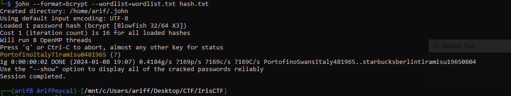

# A Harsh Reality of Passwords
> Recently, Iris's company had a breach. Her password's hash has been exposed. This challenge is focused on understanding Iris as a person.

>Focus on Iris and what she finds important!
There are three words (not letters, but words), and a certain amount of numbers following it
There's no leet words, proper capitalization nothing like (ExAmPLE), no special characters as well like -,! etc.

### Solution

Hash: ```$2b$04$DkQOnBXHNLw2cnsmSEdM0uyN3NHLUb9I5IIUF3akpLwoy7dlhgyEC```

First, we need to identify the hash that had been used which is <a href = "https://en.wikipedia.org/wiki/Bcrypt">Blowfish-based crypt ('bcrypt')</a>.

Then, we need to find what things that Iris finds important. From her Instagram posts, there are several instances where she mention something is important to her.
* Her mom's birthday (8 April 1965)
* Portofino (important place to Iris)
* Tiramisu (her obsession)

There are also some mentions about the location that she went such as Italy, Berlin, Milan, Netherlands and etc.

So, we can create a Python script to create a wordlist consist of those important words and her mother's birthday. Since there is no mention of the date format. I listed all possibile format such as DD/MM/YYYY, MM/DD/YYYY and YYYY/MM/DD. Also need to take note the zeroes in day and month (```'04081965'``` and ```'0481965'``` are different format). There is also possibility that the password is all uppercase or lowercase.

By calling ```generate_wordlist()```, it will iterate the ```words``` and ```date_formats``` array and append the words and date into a string. It then convert the string into uppercase and lowercase before been writen into wordlist.txt file. 

```python
from itertools import product

# List of potential words
words = ['Portofino', 'Tiramisu', 'Milan', 'Starbucks', 'Berlin', 'Italy', 'Netherlands', 'Swans', 'Swarovski', 'Amsterdam']

# List of possible date formats
date_formats = ['04081965', '19650408', '08041965', '19650804','0481965','481965','1965408','196548','8041965','0841965']

# Function to generate all combinations
def generate_wordlist(words, date_formats):
    wordlist = []
    
    for word_combo, date_format in product(product(words, repeat=3), date_formats):
        # Upper and lower case variations for each word in the combination
        for word in word_combo:
            entry = ''.join(word_combo) + date_format
            wordlist.append(entry)
            wordlist.append(entry.upper())
            wordlist.append(entry.lower())
    
    return wordlist

# Generate wordlist
result_wordlist = generate_wordlist(words, date_formats)

result_wordlist = list(set(result_wordlist))
# Write wordlist to file
with open('wordlist.txt', 'w') as file:
    for item in result_wordlist:
        file.write(item + '\n')

print(f"{len(result_wordlist)} passwords have been created and written to wordlist.txt.")

```

After running the script, we will have our custom wordlist. Now, we need to store the hash inside a text file called ```hash.txt```.

We can use ```john the ripper``` to crack the bcrypt hash.

```
john --format=bcrypt --wordlist=wordlist.txt hash.txt
```


### Flag 
The flag for this challenge is ```irisctf{PortofinoItalyTiramisu0481965}```
