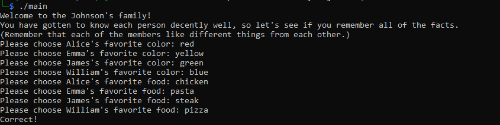

# The Johnson's

### Solution

First, we need to know what happens when we execute the main file. It will prompt us the favourite food and colors of the Johnson's family memebers. If we answer all correctly, It will give us the flag. I will be using Ghidra to reverse engineer the given main file.

We can see some ```strcmp``` functions that compares input with certain color name and foods. If iVar1 equals 0, the color and food name will be associate to the given option.

Color Options
```
red = 1
blue = 2
green = 3
yellow = 4
```

``` c
    iVar1 = strcmp(input,red);
    if (iVar1 == 0) {
      color_option = 1;
      LAB_00101449:
    }
    else {
      iVar1 = strcmp(input,blue);
      if (iVar1 == 0) {
        color_option = 2;
        goto LAB_00101449;
      }
      iVar1 = strcmp(input,green);
      if (iVar1 == 0) {
        color_option = 3;
        goto LAB_00101449;
      }
      iVar1 = strcmp(input,yellow);
      if (iVar1 == 0) {
        color_option = 4;
        goto LAB_00101449;
      }
```
Food Options
```
pizza = 1
pasta = 2
steak = 3
chicken = 4
```

```c
    iVar1 = strcmp(input,pizza);
    if (iVar1 != 0) break;
      food_option = 1;
      LAB_0010159c:

    iVar1 = strcmp(input,pasta);
    if (iVar1 == 0) {
      food_option = 2;
      goto LAB_0010159c;
    }
    iVar1 = strcmp(input,steak);
    if (iVar1 == 0) {
      food_option = 3;
      goto LAB_0010159c;
    }
    iVar1 = strcmp(input,chicken);
    if (iVar1 == 0) {
      food_option = 4;
      goto LAB_0010159c;
    }
```

The, we need to understand the check() function. 
```c
void check(void)

{
  byte bVar1;
  bool bVar2;
  
  if ((chosenFoods[2] == 2) || (chosenFoods[3] == 2)) {
    bVar2 = false;
  }
  else {
    bVar2 = true;
  }
  if ((chosenColors[0] == 3) || (chosenColors[1] == 3)) {
    bVar1 = 0;
  }
  else {
    bVar1 = 1;
  }
  if (chosenColors[3] == 2 &&
      (chosenColors[2] != 4 &&
      (chosenFoods[3] != 3 &&
      (chosenFoods[0] == 4 && (bool)((chosenColors[1] != 1 && bVar2) & bVar1))))) {
    puts("Correct!");
    system("cat flag.txt");
  }
  else {
    puts("Incorrect.");
  }
  return;
}
```

In order to get the flag, we need to make sure that ```bVar1``` is 1, ```bVar2``` is true, color and food for each members is correct.

```
1) chosenFoods[2] and chosenFoods[3] are not 2 (pasta)
2) chosenColors[0] and chosenColors[1] are not 3 (green)
3) chosenColors[3] is 2 (blue)
4) chosenColors[2] is not 4 (yellow)
5) chosenFoods[3] is not 3 (steak)
6) chosenFoods[0] is 4 (chicken)
7) chosenColors[1] is not 1 (red)
```

After listing all the conditions, we can determine which are the correct answer since the options will not repeat twice.
```
Colors
chosenColors[0] = red
chosenColors[1] = yellow
chosenColors[2] = green
chosenColors[3] = blue

Foods
chosenFoods[0] = chicken
chosenFoods[1] = pasta
chosenFoods[2] = steak
chosenFoods[3] = pizza
```



